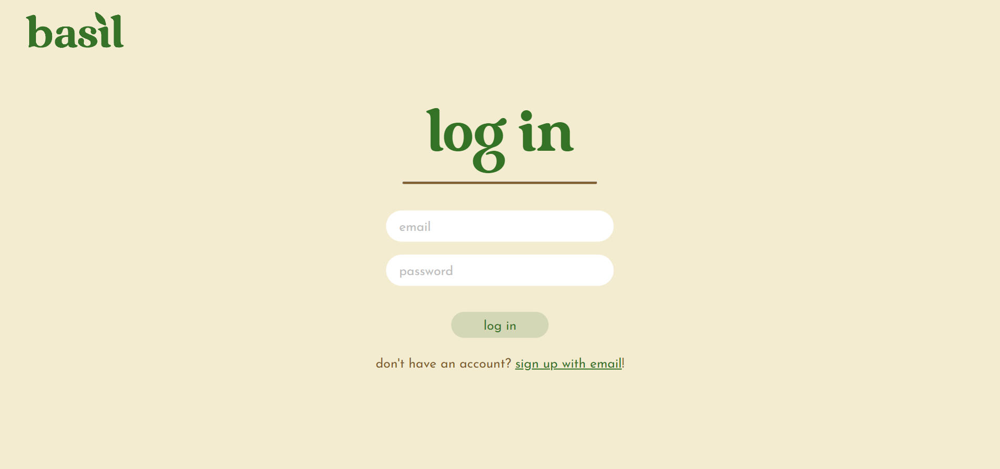
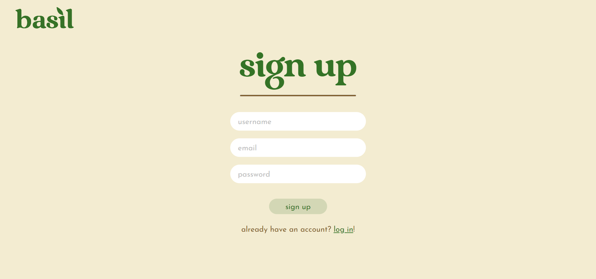
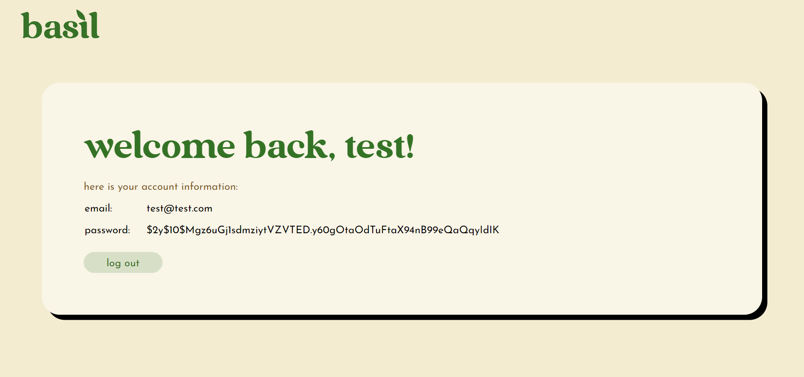

# Secure Login and Registration System
A secure login and registration system built using PHP, MySQL, HTML and CSS. 

HTML utilizes its forms to collect information needed to log in and sign up for the website and for the contents of the page. CSS is used to style the website. 
PHP is the backbone for the entire system and is used to build the interactive website on the web server. 
Lastly, MySQL is used to insert and retrieve private information into and from the secure database. 

## Setup
* Start a web server environment if you haven't already. To do so, you could install a web server application like XAMPP. 

* Create a database (use the name `"myDB"`) and execute the MySQL statement from `table.sql` to create a new table. 

* Here is the code for easier access:
```
CREATE TABLE IF NOT EXISTS `accounts` (
    `id` int(10) NOT NULL AUTO_INCREMENT,
    `username` varchar(50) NOT NULL,
    `password` varchar(255) NOT NULL,
    `email` varchar(255) NOT NULL UNIQUE,
    PRIMARY KEY (`id`) 
) ENGINE=InnoDB;
```

* If necessary, edit the login credentials in the `*.php` files accordingly. 

* Finally, run `index.html` from your web server.









## References
* [CodeShack's Secure Login System with PHP and MySQL](https://codeshack.io/secure-login-system-php-mysql/)
* [CodeShack's Secure Registration System with PHP and MySQL](https://codeshack.io/secure-registration-system-php-mysql/)
* [GrooTech's How to Build a Secure Login Page in PHP](https://levelup.gitconnected.com/how-to-build-a-secure-login-page-in-php-954f51d08701)
